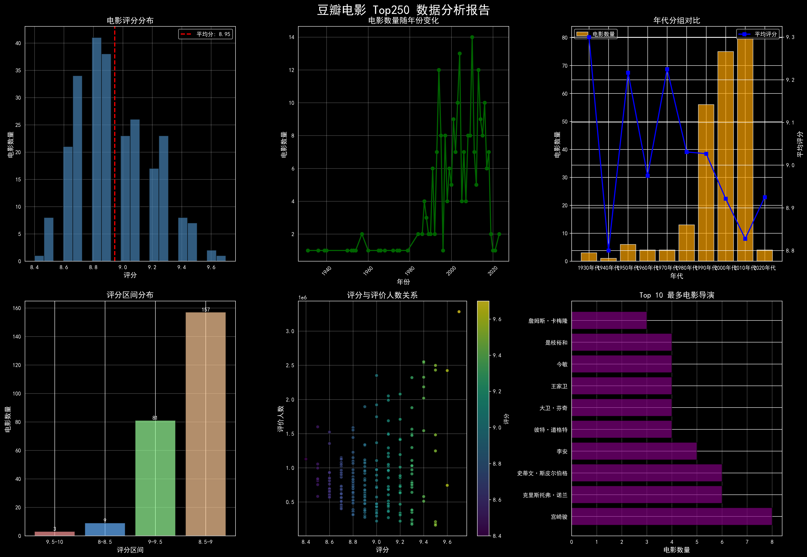

# 🎬 豆瓣电影 Top250 数据分析


> 基于 Scrapy 爬取豆瓣电影 Top250 数据，经 Pandas 清洗分析后写入 MySQL，并通过 Matplotlib 生成多维度可视化报告的完整数据分析项目。

---

## 📊 分析报告预览



> 图表包含：评分分布、年份趋势、评分区间分布、导演 Top10 等核心维度

---

## ✨ 项目亮点

- **完整数据链路**：采集 → 清洗 → 存储 → 分析 → 可视化，端到端闭环
- **双存储方案**：数据同时输出为 JSON / CSV 文件与 MySQL 数据库
- **工程化爬虫**：AutoThrottle 自动限速、随机延迟、UA 伪装，友好合规爬取
- **多维度分析**：评分分布、时间趋势、导演排行、国家分布、相关性分析

---

## 🛠️ 技术栈

| 模块 | 技术 |
|-----|------|
| 数据采集 | Python 3、Scrapy、XPath |
| 数据存储 | JSON、CSV、MySQL 8.0、pymysql |
| 数据处理 | Pandas、NumPy |
| 数据可视化 | Matplotlib、Seaborn |
| 开发工具 | PyCharm、Navicat、Git |

---

## 📁 项目结构

```
douban-top250-analysis/
├── douban_spider/                 # Scrapy 爬虫项目
│   ├── spiders/
│   │   └── douban_top250.py      # 核心爬虫：XPath 解析 + 分页
│   ├── items.py                  # 数据模型定义
│   ├── pipelines.py              # 双管道：JSON 存储 + MySQL 写入
│   ├── middlewares.py            # 下载中间件
│   └── settings.py               # 爬虫配置（限速/UA/AutoThrottle）
├── sql/
│   └── analysis.sql              # 10+ 条数据分析 SQL 语句
├── douban_top250.json            # 原始爬取数据（250条）
├── douban_top250_analysis.csv    # 清洗后结构化数据
├── douban_top250_analysis.png    # 可视化分析报告
├── analysis.py                   # Pandas 数据分析 + 可视化脚本
├── requirements.txt              # 依赖列表
└── README.md
```

---

## 🚀 快速开始

### 1. 克隆仓库

```bash
git clone https://github.com/你的用户名/douban-top250-analysis.git
cd douban-top250-analysis
```

### 2. 安装依赖

```bash
pip install -r requirements.txt
```

### 3. 配置 MySQL

在 MySQL 中创建数据库：

```sql
CREATE DATABASE scrapy CHARACTER SET utf8mb4 COLLATE utf8mb4_unicode_ci;
```

修改 `douban_spider/pipelines.py` 中的数据库连接信息：

```python
self.conn = pymysql.connect(
    host='localhost',
    user='root',
    password='你的密码',   # ← 替换为你的密码
    db='scrapy',
    charset='utf8mb4'
)
```

### 4. 运行爬虫

```bash
cd douban_spider
scrapy crawl douban.top250
```

爬取完成后，数据将同步写入：
- `douban_top250.json`（项目根目录）
- MySQL `scrapy.douban_movies` 表

### 5. 运行数据分析

```bash
python analysis.py
```

生成可视化报告 `douban_top250_analysis.png`

---

## 📈 分析结论

通过对豆瓣 Top250 电影数据的多维度分析，得出以下核心结论：

| 结论 | 数据支撑 |
|-----|---------|
| 🏆 评分主要集中在 8.5–9.0 区间 | 该区间占比约 **63%**（157 部） |
| 📅 2000 年后经典电影数量显著增多 | 2000–2020 年贡献了 Top250 中超过 **60%** 的作品 |
| 🎬 宫崎骏上榜作品最多 | 共 **8 部**作品入选，位居导演榜首 |
| ⭐ 最高评分电影 | 《肖申克的救赎》以 **9.7 分**、**328 万+** 评价人数领跑 |
| 💬 评分与热度存在弱正相关 | Pearson r ≈ 0.23，高评分往往伴随更高关注度 |

---

## 🗄️ 数据库表结构

```sql
CREATE TABLE douban_movies (
    `rank`         INT PRIMARY KEY COMMENT '排名',
    title          VARCHAR(100)  COMMENT '电影名称',
    director       VARCHAR(200)  COMMENT '导演',
    attrs          TEXT          COMMENT '主演',
    `date`         VARCHAR(50)   COMMENT '上映年份/国家/类型',
    rating_num     FLOAT         COMMENT '豆瓣评分',
    rating_people  INT           COMMENT '评价人数'
) CHARACTER SET utf8mb4;
```

---

## 📝 SQL 分析示例

```sql
-- 上榜作品最多的导演 TOP10
SELECT director, COUNT(*) AS cnt, ROUND(AVG(rating_num), 2) AS avg_rating
FROM douban_movies
GROUP BY director
ORDER BY cnt DESC
LIMIT 10;

-- 评分高于均值的电影数量
SELECT COUNT(*) AS above_avg
FROM douban_movies
WHERE rating_num > (SELECT AVG(rating_num) FROM douban_movies);

-- 各评分区间分布
SELECT
  CASE
    WHEN rating_num >= 9.5 THEN '9.5~10.0'
    WHEN rating_num >= 9.0 THEN '9.0~9.5'
    WHEN rating_num >= 8.5 THEN '8.5~9.0'
    ELSE '8.0~8.5'
  END AS rating_range,
  COUNT(*) AS cnt
FROM douban_movies
GROUP BY rating_range
ORDER BY rating_range DESC;
```

---

## 📦 依赖列表

```
scrapy>=2.11.0
pymysql>=1.1.0
pandas>=2.0.0
matplotlib>=3.7.0
seaborn>=0.12.0
scipy>=1.11.0
```

---

## ⚠️ 免责声明

本项目仅用于**学习和技术研究**目的，爬取频率严格控制（延迟 3s+，单线程），不用于任何商业用途。数据来源：[豆瓣电影](https://movie.douban.com/top250)。

---

## 📄 License

[MIT](LICENSE) © 2026
